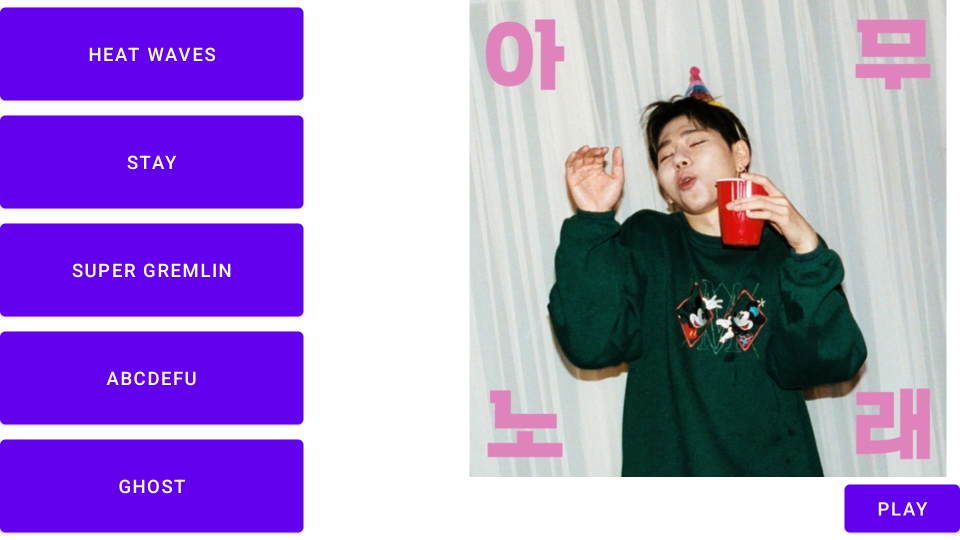
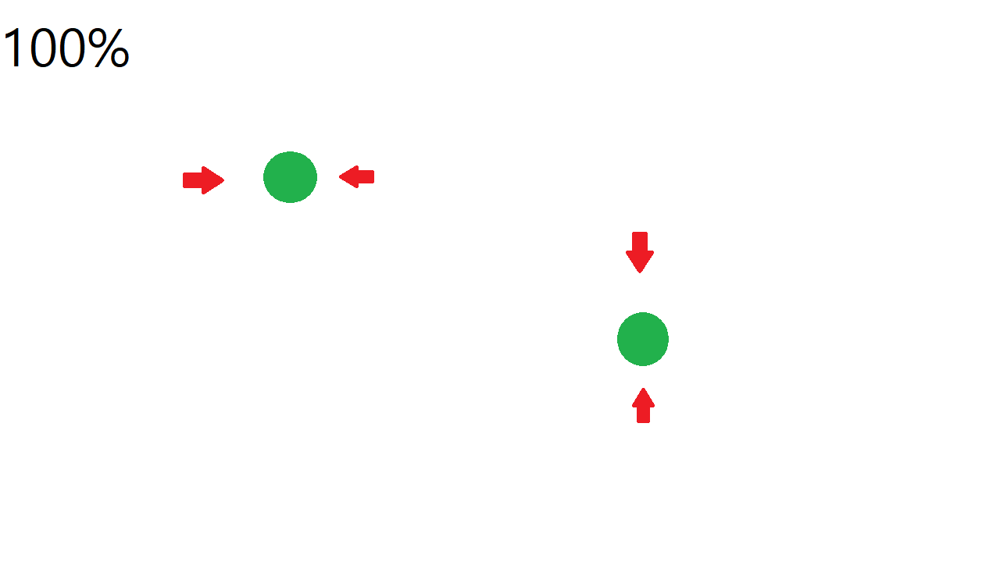
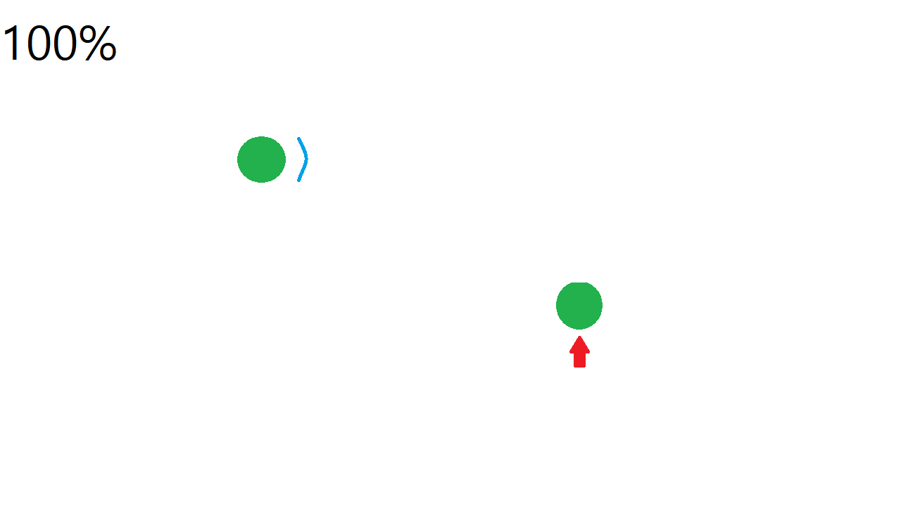

Rythm Defender
=============

##게임 컨셉
리듬에 맞춰 화면 곳곳에 생성되는 점을 클릭, 드래그해 점으로 몰려오는 화살표를 막는 리듬게임

##게임 진행
* 게임은 landscape로 진행된다.
* 리듬과 미리 제작된 순서에 맞춰 화면에 점이 생성된고 사라진다.
* 점 주위에 한개 혹은 여러개의 화살표가 생성되고 그 점을 향해 움직인다.
* 화살표가 점에 닿게되면 플레이어는 점수를 잃는다.
* 플레이어가 점을 누르고 드래그하면 드래그한 방향으로 호 모양의 방어막이 생긴다.
Rythm Defender
=============

## 게임 컨셉
* 리듬에 맞춰 화면 곳곳에 생성되는 점을 클릭, 드래그해 점으로 몰려오는 화살표를 막는 리듬게임

## 핵심 메카닉
* 게임은 landscape로 진행된다.
* 리듬에 맞춰 미리 제작된 순서에 따라 화면에 점이 생성되고 사라진다.
* 점 주위에 한 개 혹은 여러 개의 화살표가 생성되고 그 점을 향해 움직인다.
* 화살표가 점에 닿게 되면 플레이어는 점수를 잃는다.
* 플레이어가 점을 누르고 드래그하면 드래그한 방향으로 호 모양의 방어막이 생긴다.
* 화살표가 방어막에 닿으면 화살표는 사라진다.
* 플레이어는 화살표가 점에 닿기 전에 방어막을 생성해 화살표를 막아야 한다.

## 개발 범위

* 채보: 각 음악 마다 점과 화살표가 생성되는 시간, 위치 등을 기록한 파일
	 * 점은 생성 시간과 소멸시간, 위치 그리고 화살표들을 시간순서대로 기록한다.
	 * 화살표는 생성 시간과 점에 도달하는 시간, 점에 대한 상대적 위치를 생성 시간 순서대로 기록한다.
	* 채보 json 예:
		 ```json
		{
	   "musicName": "Jump Up Super Star",
	   "points": [
	      {
		 "startTime": 10,
		 "endTime": 20,
		 "x": 300,
		 "y": 250,
		 "arrow": [
		    {
		       "startTime": 10,
		       "endTime": 13,
		       "x": 10,
		       "y": -5
		    },
		    {
		       "startTime": 16,
		       "endTime": 20,
		       "x": -5,
		       "y": 10
		    }
		 ]
	      },
	      {
		 "startTime": 50,
		 "endTime": 70,
		 "x": 100,
		 "y": 50,
		 "arrow": [
		    {
		       "startTime": 50,
		       "endTime": 60,
		       "x": 7,
		       "y": -7
		    }
		 ]
	      }
	   ]
	}
		```
* 음악 선택 뷰: 플레이할 레벨을 선택하는 뷰
	* 구성요소
		* 음악 선택 버튼: 가로 길이는 화면 가로길이의 1/3이다. 세로 길이는 화면 세로길이의 1/5이다. 화면의 왼쪽에 5개가 세로 정렬로 배치한다.
		* 음악 일러스트: 가로 길이는 화면 가로길이의 1/2이다. 세로 길이는 화면 세로길이의 9/10이다. 화면의 오른쪽 위에 배치한다.
		* 플레이 버튼: 가로 길이는 화면 가로길이의 1/7이다. 세로 길이는 화면 세로길이의 1/10이다, 화면 오른쪽에 일러스트 밑에 배치한다.
		

* 메인 게임 뷰: 실제 플레이가 일어나는 게임 뷰
	* 구성요소
		* 점: 크기(지름)는 화면의 세로 길이의 1/6이다.
		* 화살표: 세로는 화면의 세로 길이의 1/4, 가로는 1/8이다.
		* 점수: 화면 왼쪽 위에 배치하는 텍스트다. 텍스트는 좌에서 우로 적힌다. 0~100%로 표시되고 크기는 화면의 세로 길이의 1/10이다.
		* 방어막: 크기(지름)은 점의 지름의 1.3배다. 호를 이루는 각은 45도이다.  

## 예상 게임 실행 흐름
* 게임 실행시 음악 선택 뷰가 표시된다. 
* 플레이할 음악을 선택해 플레이 버튼을 누르면 메인 게임 뷰로 넘어간다.

* 음악이 재생되며 채보에 맞게 점, 화살표가 생성된다.

* 시간에 따라 화살표가 점 방향으로 이동한다.
* 플레이어의 터치를 받아 점의 위치에서 터치해 드래그한 방향을 구해 점에서 그 방향으로 방어막을 생성한다.

* 화살표는 방어막이나 점에 부딪히면 사라진다.

* 터치가 끝나거나 점이 사라지면 방어막은 사라진다.
* 음악이 끝나면 게임이 종료된다.

## 개발 일정
|주차|개발일정|
|--|--|
|1주차(4.04 ~ 4.10)| 리소스 수집 (점, 화살표, 방어막 등에 쓰일 이미지, 음악 등)|
|2주차(4.11 ~ 4.17)| 메인 게임 뷰의 onDraw 함수 제작 |
|3주차(4.18 ~ 4.24)| 메인 게임 뷰 구성 요소의 생성자와 충돌체크를 포함한 클래스 제작 |
|4주차(4.25 ~ 5.01)| 채보를 메모리로 읽어 시간에 따라 점, 화살표를 생성할 수 있는 클래스 제작 |
|5주차(5.02 ~ 5.08)| 음악의 리듬에 맞춰 채보 제작 |
|6주차(5.09 ~ 5.15)| 음악 선택 뷰 제작 |
|7주차(5.16 ~ 5.22)| 버그 수정 및 추가 구현 |
|8주차(5.23 ~ 5.29)| 추가 채보 제작 |
|9주차(5.30 ~ )| 최종 발표 준비 |
	


