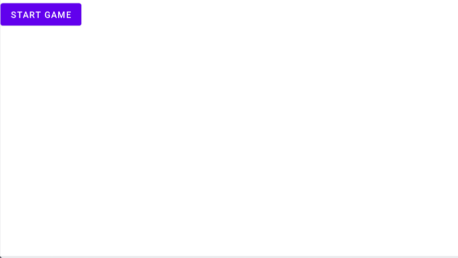

Rythm Defender
=============

## 게임 컨셉
* 리듬에 맞춰 화면 곳곳에 생성되는 점을 클릭, 드래그해 점으로 몰려오는 화살표를 막는 리듬게임

## 핵심 메카닉
* 게임은 landscape로 진행된다.
* 리듬에 맞춰 미리 제작된 순서에 따라 화면에 점이 생성되고 사라진다.
* 점 주위에 한 개 혹은 여러 개의 화살표가 생성되고 그 점을 향해 움직인다.
* 화살표가 점에 닿게 되면 플레이어는 점수를 잃는다.
* 플레이어가 점을 누르고 드래그하면 드래그한 방향으로 호 모양의 방어막이 생긴다.
* 화살표가 방어막에 닿으면 화살표는 사라진다.
* 플레이어는 화살표가 점에 닿기 전에 방어막을 생성해 화살표를 막아야 한다.

## 개발 범위

* 채보: 각 음악 마다 점과 화살표가 생성되는 시간, 위치 등을 기록한 파일
	 * 점은 생성 시간과 소멸시간, 위치 그리고 화살표들을 시간순서대로 기록한다.
	 * 화살표는 생성 시간과 점에 도달하는 시간, 점에 대한 상대적 위치를 생성 시간 순서대로 기록한다.
	* 채보 json 예:
		 ```json
		{  
			"musicName": "Jump Up Super Star",
			"points": [
				{  
					"startTime": 10,
					"endTime": 20,
					"x": 300,
					"y": 250,
					"arrow":[
							{
								"startTime" : 10,  
								"endTime" : 13,  
								"x" : 10,  
								"y" : -5  
							},  
							{  
					          "startTime" : 16,
					          "endTime" : 20,
					          "x" : -5,
					          "y" : 10
					     }
					 ]  
			    },  
			  {  
					"startTime": 50,
					"endTime": 70,
					"x": 100,
					"y": 50,
					"arrow":[
							{
								"startTime" : 50,  
								"endTime" : 60,  
								"x" : 7,  
								"y" : -7  
							}
					]  
				}  
			]  
	    }  
		```
* 음악 선택 뷰: 플레이할 레벨을 선택하는 뷰
	* 구성요소
		* 음악 선택 버튼: 가로 길이는 화면 가로길이의 1/3이다. 세로 길이는 화면 세로길이의 1/5이다. 화면의 왼쪽에 5개가 세로 정렬로 배치한다.
		* 음악 일러스트: 가로 길이는 화면 가로길이의 1/2이다. 세로 길이는 화면 세로길이의 9/10이다. 화면의 오른쪽 위에 배치한다.
		* 플레이 버튼: 가로 길이는 화면 가로길이의 1/7이다. 세로 길이는 화면 세로길이의 1/10이다, 화면 오른쪽에 일러스트 밑에 배치한다.
		

* 메인 게임 뷰: 실제 플레이가 일어나는 게임 뷰
	* 구성요소
		* 점: 크기(지름)는 화면의 세로 길이의 1/6이다.
		* 화살표: 세로는 화면의 세로 길이의 1/12, 가로는 1/24이다. (너무 커서 수정 )
		* 점수: 화면 왼쪽 위에 배치하는 텍스트다. 텍스트는 좌에서 우로 적힌다. 0~100%로 표시되고 크기는 화면의 세로 길이의 1/10이다.
		* 방어막: 크기(지름)은 점의 지름의 1.3배다. 호를 이루는 각은 45도이다.  

## 예상 게임 실행 흐름
* 게임 실행시 음악 선택 뷰가 표시된다. 
* 플레이할 음악을 선택해 플레이 버튼을 누르면 메인 게임 뷰로 넘어간다.

* 음악이 재생되며 채보에 맞게 점, 화살표가 생성된다.

* 시간에 따라 화살표가 점 방향으로 이동한다.
* 플레이어의 터치를 받아 점의 위치에서 터치해 드래그한 방향을 구해 점에서 그 방향으로 방어막을 생성한다.

* 화살표는 방어막이나 점에 부딪히면 사라진다.

* 터치가 끝나거나 점이 사라지면 방어막은 사라진다.
* 음악이 끝나면 게임이 종료된다.


## 개발 일정
|주차|개발일정|
|--|--|
|1주차(4.04 ~ 4.10)| 리소스 수집 (점, 화살표, 방어막 등에 쓰일 이미지, 음악 등)|
|2주차(4.11 ~ 4.17)| 메인 게임 뷰의 onDraw 함수 제작 |
|3주차(4.18 ~ 4.24)| 메인 게임 뷰 구성 요소의 생성자와 충돌체크를 포함한 클래스 제작 |
|4주차(4.25 ~ 5.01)| 채보를 메모리로 읽어 시간에 따라 점, 화살표를 생성할 수 있는 클래스 제작 |
|5주차(5.02 ~ 5.08)| 음악의 리듬에 맞춰 채보 제작 |
|6주차(5.09 ~ 5.15)| 음악 선택 뷰 제작 |
|7주차(5.16 ~ 5.22)| 버그 수정 및 추가 구현 |
|8주차(5.23 ~ 5.29)| 추가 채보 제작 |
|9주차(5.30 ~ )| 최종 발표 준비 |

## 진행 상황
* 메인 게임 뷰: 90% 완료
	* 현재 게임 object들은 모두 구현 완료
	* json에서 채보를 읽어와 적용하는 것만 남음


* 나머지 진행사항 없음

## 변경 사항
* 화살표: 세로는 화면의 세로 길이의 ( 1/4 -> 1/12 ), 가로는 ( 1/8 -> 1/24 )이다. (너무 커서 수정 )

## Object Class
* Circle
	* 원 그림
	* 터치와 드래그 되었을 때 Barrier를 생성
	* 시간이 지남에 따라 Arrow를 생성

* Arrow
	* 화살표 그림
	* 시간에 따라 Circle 방향으로 이동
	* Circle과 부딪히면 소멸
	* Barrier와 부딪히면 Score를 올리고 소멸

* Barrier
	* 호 그림
	* 각도에 따라 회전하며 그려진다.

* ObjectGenerator
	* draw하지 않는다.
	* 랜덤으로 Circle과 Arrow를 생성한다.
	* 차후 json에서 읽어온 채보를 토대로 Object를 생성하게 구현할 예정

 
## 개발 일정 대비 진척 사항
|주차|개발일정|실제 진행|
|--|--|--|
|1주차(4.04 ~ 4.10)| 리소스 수집 (점, 화살표, 방어막 등에 쓰일 이미지, 음악 등)| 음악 추가|
|2주차(4.11 ~ 4.17)| 메인 게임 뷰의 onDraw 함수 제작 | x | 
|3주차(4.18 ~ 4.24)| 메인 게임 뷰 구성 요소의 생성자와 충돌체크를 포함한 클래스 제작 | x |
|4주차(4.25 ~ 5.01)| 채보를 메모리로 읽어 시간에 따라 점, 화살표를 생성할 수 있는 클래스 제작 |프레임워크 제작|
|5주차(5.02 ~ 5.08)| 음악의 리듬에 맞춰 채보 제작 | 오브젝트 구현 |
|6주차(5.09 ~ 5.15)| 음악 선택 뷰 제작 | json 채보 로드 구현|
|7주차(5.16 ~ 5.22)| 버그 수정 및 추가 구현 |채보 제작 앱 구현|
|8주차(5.23 ~ 5.29)| 추가 채보 제작 |채보 제작 앱 구현|
|9주차(5.30 ~ )| 최종 발표 준비 |채보 제작, 마무리|

## 사용된 기술
* 참고한 것
	* 멀티터치 구현: android developer 사이트 참고
	* json parse: 블로그 참고

* 수업내용에서 차용한 것
	* 프레임워크
	* 리스트 뷰
* 직접 개발한 것
	* 화살 이동: 처음 점과 끝 점으로 시간에 따라 선형보간을 한다. 속도가 점점 빨라지게 보이기 위해 0~1로 된 factor를 제곱하였다.
	* 채보 제작 앱: 채보를 더욱 빠르고 간편하게 제작하기 위해 채보를 제작하는 앱을 만들었다.

## 아쉬운 것
* 하고 싶지만 못한 것
	* 화살의 색이 원에 가까워질수록 다른 색으로 변하게 하고싶었는데 시간이 부족해 하지 못했다.
	* 채보 제작하는 앱을 조금 더 디테일하게 채보를 제작 할 수 있게 하고 싶었으니 하지 못했다.
	* 더 많은 음악을 게임에 넣고 싶었으나 못했다.
* 해결하지 못한 문제/버그
	* 가끔 프레임이 끊길 때 화살이 제대로 지워지지 않는 버그가 있다. 임시방편으로 보이지만 않게 해놨다.
	* 사운드 이펙트가 조금씩 늦게 들릴 때가 있다.
	* 기기의 화면 크기에 따라 화살의 초기 생성거리가 달라진다.
* 어려웠던 점
	* 시간 부족: 졸업작품이랑 다른 과목도 같이 하면서 하다보니 시간이 부족했던 것 같다.
	* 자바와 안드로이드 API를 처음 써보아 기능들을 검색해보면서 썼는데 이해하는데 어려움이 있었다.

* 수업에 대한 내용
	* 기대한것
		* 안드로이드 API 다루어 앱 만들기
	* 얻은 것
		* 안드로이드 API 다루어 앱 만들기
		* java
		* 디자인패턴
